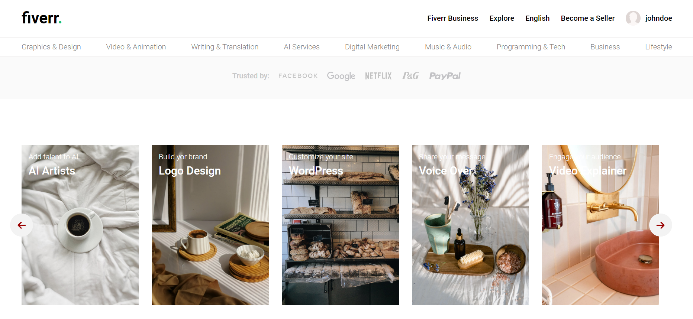
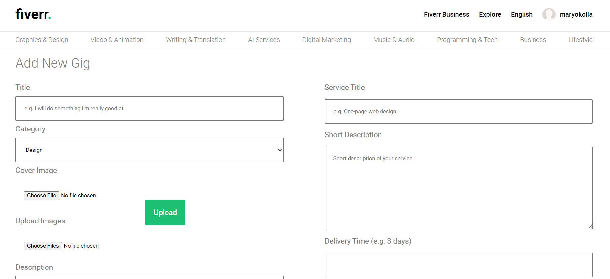

# Freelance App

This full-stack MERN freelance job marketplace application offers a comprehensive solution for connecting freelancers with job opportunities. Built on the MERN stack (MongoDB, Express.js, React.js, Node.js), it combines the power of these technologies to deliver a robust and scalable platform.

Freelancers can create profiles, showcase their skills, and search for job listings that match their expertise. Employers can post job listings, review freelancer profiles, and hire suitable candidates.

With integrated Stripe payment integration, this application enables secure and seamless payment transactions between freelancers and employers. This ensures that freelancers are compensated for their work and employers can easily manage their financial transactions.

The React.js frontend provides a dynamic and intuitive user interface, while Node.js and Express.js handle server-side operations, ensuring efficient communication between clients and the server. MongoDB serves as the database, ensuring reliable storage and retrieval of job listings and user information.

This full-stack MERN freelance job marketplace application revolutionizes the way freelancers and employers connect, making it easier to find and manage freelance work while facilitating secure payment transactions through Stripe integration.

## Technology

- JavaScript
- React
- Node
- Express
- MongoDB
- React Query
- SASS

## Views

  

  

## Setup

- Clone the project: `git@github.com:rOluochKe/freelance-app.git`
- Change directory into both client and server directories separately: `cd /client && cd /server`
- Install the required dependencies for both client and server: `npm install`
- Setup mongodb database and add url to `.env` file configuration
- Run both the applications simultaneously: client `npm run dev` and server `npm run dev`
- View the application on the browser using `http://localhost:5173`
